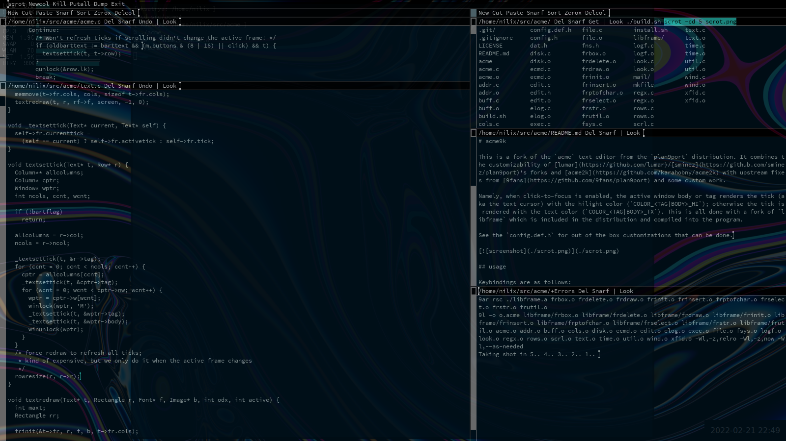
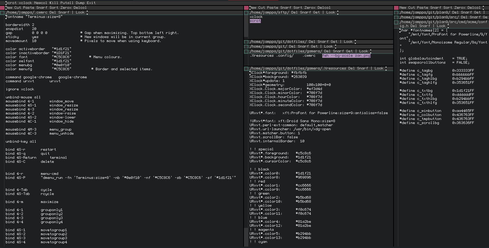
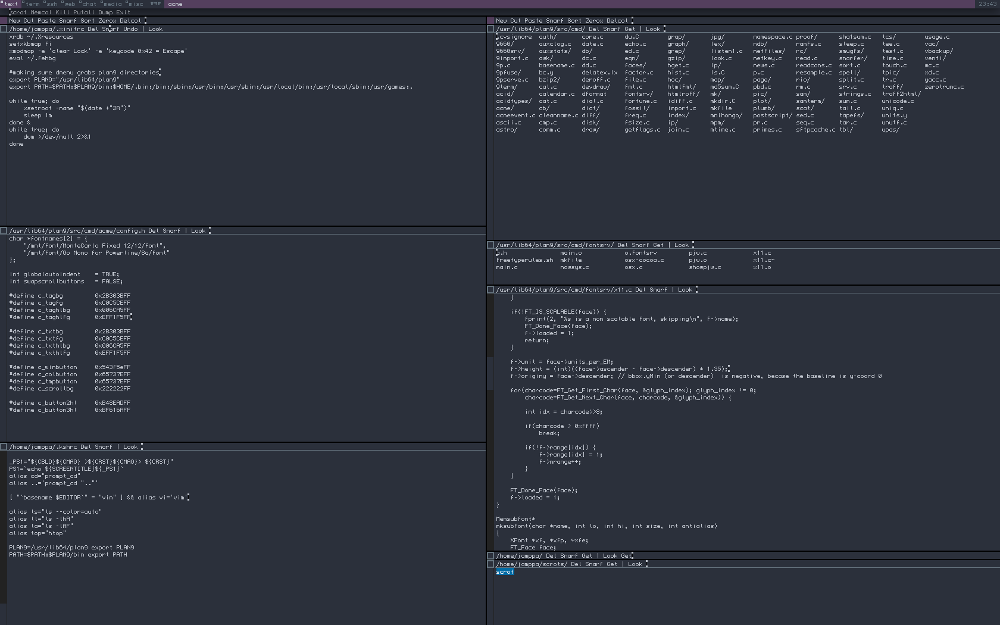
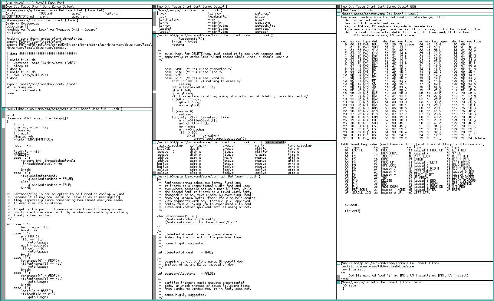

# acme9k


### ACME INTERNATIONAL COMPILED EDITORS

#### THEY EDIT LIKE HELL.
```
   No editor made, pretty much anywhere,

surpasses our Acme in shape, material or finish.
```


>solid forged of unsigned int pieces of best wrought C, linked at the binary; tag line is made of one piece of code, compiled with -funroll-loops to the the rest of the window column and warranted with a [permissive license](LICENSE). text window has sufficient refactoring done to insure stability and prevent SEGFAULTing; has ug, but perfectly written shell: [rc](http://doc.cat-v.org/plan_9/4th_edition/papers/rc); acme is linted and debugged by a special compiler so that there are no functions that return structures or integer and floating numbers in object code not converted to known formats and byte orders; [config.h](config.def.h) should be perfectly tempered by the user or it will fuck up. mkfiles are straight and true, so you will have no trouble on account of acme returning cryptic compiler errors and not compiling.


This is a fork of the `acme` text editor from the `plan9port` distribution. It combines the customizability of [lumar](https://github.com/lumar) and [sminez](https://github.com/sminez/plan9port)'s forks and [acme2k](https://github.com/karahobny/acme2k) with upstream fixes from [9fans](https://github.com/9fans/plan9port), [9front](https://9front.org), and some custom work.


Namely, when click-to-focus is enabled, the active text frame renders the tick (aka the text cursor) with the hilight color (`COLOR_<TAG|BODY>_HI`); otherwise the tick is rendered with the text color (`COLOR_<TAG|BODY>_TX`). This is all done with a fork of `libframe` which is included in the distribution and compiled into the program, and some simple logic that selects the proper ticks for each frame when the focus changes and forces a redraw.


See the `config.def.h` for out of the box customizations that can be done. Below is a screenshot of a typical setup (note there are compositing rules to make the window transparent, this is not in the scope of `acme` itself).

[

## acme9k features

+ A centralized `config.h`-header heavily inspired by suckless school of software design philosophy; allowing customization of software specifically prior to its compilation

  + autoindent, swapscrollbars, fonts and the `acme2k` colorscheme modifiable by the user, or shared by a community of likemined `acme9k`-enthusiasts, allowing for a personalized and/or collaborative look and feel.
    + with 14 elements to define your very own colors for. Simply breathtaking. I do say, wow.

  + the so-called bartflag ( = *window focus not following the mouse pointer*) removed as a runtime flag and moved to a configurable option in `config.h`. Yeah, I’ve also gone ahead and set that to **TRUE** on default, since mouse accidentally moving and changing the focus from the tag window—it occupying a rather limited area—to the middle of the text and editing the file in question by accident, seemed to be a common complaint online and a general nuisance for me.

+ No zero-sum game between the mouse and the keyboard: balancing the options so you are not doomed to pick up the mouse as soon as you've overstepped the boundaries of keybindings

  + arrow keys navigate through text up one letter and down one letter instead of scrolling seemingly indiscriminate amount of lines, making you take your time finding where you were supposed to be at that very moment.

  + `CTRL+C`, `CTRL+X`, `CTRL+V` for snarfing, cutting and pasting selected text
  
  + `CTRL+Z` for undo and `CTRL+Y` for redo

  + `HOME` and `END` move the cursor to the start or to the end of the current line respectively as do the original keybindings `ATRL+A` and `CTRL+E`. (Originally intended to remove them, and I still might if I find better uses for those shortcuts.)

  + `DEL` deletes all text from the start of the line until cursor position. (a placeholder feature tbh)

## usage

Keybindings are as follows:

- CTRL
  - C: copy
  - X: cut
  - V: paste
  - Z: undo
  - Y: redo
  - S: save
  - E: move to end of line
  - A: move to begining of line
  - F: filename completion
  - U: kill line
  - W: kill word (backwords)
- Up/Down: move cursor
- PgUp/PgDown: the obvious
- Esc: cut if there is a selection, otherwise highlight the most recently edited text

Users unfamiliar with `acme` in general should check the following resources:

- [Acme: A User Interface for Programmers](http://doc.cat-v.org/plan_9/4th_edition/papers/acme/) - the definitive guide from Rob Pike
- [A Tour of Acme](https://research.swtch.com/acme) - Russ Cox giving a tour of acme on plan9port (video)
- [acme(1)](http://man.cat-v.org/plan_9/1/acme) - manual page

## config

### config.h
`config.h` includes all the neccesary color and font modifications you just need to `mk install` it after every time you modify it, strongly inspired by suckless design philosophy of software. Feel free to read more about it [here](https://suckless.org/philosophy). (They are Neönazis btw)

#### fonts
You run `fontsrv -p .` to list all the available fonts from X11 to fontsrv; basically its only limited to your installed TrueType-fonts, so if you wish to use a bitmap font, make sure you specifically have the `.ttf` available; and then use the fonts in a format like this for example:
```sh
"/mnt/font/[listed font]/[font size][a(ntialias)/no a(antialias)]/font"

"/mnt/font/Monaco/9a/font",
"/mnt/font/GohuFont/9/font",
```
In this case the first option would stand for Monaco size 9 antialiased, the second for GohuFont size 9 aliased, ofc; or you can use the full path to your plan9 converted .font-file, found in this git repositorys `font/` directory.

The first font in `config.h` is treated as a proportional width font and is used everywhere in `acme`, and by extension `acme9k`, by default. The second one can be activated for a specific window by executing `Font` from its tag window.

## build

- `acme9k` depends on `Plan 9 from User Space` which can be found [here](https://github.com/9fans/plan9port) or on your local repository. I know some distros have stripped *plan9*-userpaces (like Debian `9base`) but I wouldn't roll the dice with this working with only it as a dependency. You need the full p9p.
- Clone this repository.
- From the repo root, if desired, copy `config.def.h` to `config.h` and make your modifications (you will almost certainly want to change the fonts; my default primary font is Sauce Code Pro Nerd Font)
- Run `./build.sh` from the repo root.

## install

After building, run `./install.sh`. If run as a regular user, it will install to `~/bin/9`, if run as root it will overwrite the systemwide `acme` in `$PLAN9/bin`.

## helpers

The `scripts` directory contains some helpers, mostly just shortcuts for [acme-lsp](https://github.com/fhs/acme-lsp). Also shortcuts to change font size and a `Slide` utility (for presentations). Copy them to your `$PATH` and let 'em rip.

These work only in window tags (not column or row tags):

- `F+`: increase font size
- `F-`: decrease font size
- `Slide+`: move to the next file in the current directory (alphabetical order)
- `Slide-`: move to the previous file in the current directory (alphabetical order)
- `Slide`: move to the named file in the current directory (called by the previous two)

These will work anywhere:

- `agols`: pass a colon-separated list of workspaces to start `acme-lsp` for go development
- `atsls`: pass a colon-separated list of workspaces to start `acme-lsp` for javascript/typescript development
- `acls`: pass a colon-separated list of workspaces to start `acme-lsp` for C/C++ development
- `acsls`: pass a colon-separated list of workspaces to start `acme-lsp` for C# development

For `acls` to work right with plan9port C stuff you will need to add your `$PLAN9/include` directory to the compile flags in either the project `.clangd` file or your `~/.config/clangd/config.yaml`:

```
CompileFlags:
  Add: 
    - "-I/usr/lib/plan9/include"
```

The C# server doesn't seem to be able to handle metadata yet (eg, going to definitions that are part of the standard library or packages).

See also:

- [plumbing rules](https://nilfm.cc/git/dotfiles/tree/plumbing) - my plumbing rules, includes opening headers by right-click on the filename in an include directive

The `Toolbox` file contains a compilation of `sam` command language (`Edit` scripts) that may be useful.

## thanks

- [Rob Pike](https://github.com/robpike) - author of the original `acme` for Plan9
- [Russ Cox](https://research.swtch.com) and the rest of the [9fans](https://github.com/9fans) for [plan9port](https://github.com/9fans/plan9port)
- [lumar](https://github.com/lumar) - looks like they deleted their GitHub repos but I originally pulled my keybinds from there
- [sminez](https://github.com/sminez) - possibly the original source of Lumar's keybindings
- [karahobny](https://github.com/karahobny) - creator of acme2k
- [nilix](https://hacklab.nilfm.cc/) - creator of acme9k
- [aksr](https://github.com/aksr) - source of the missing tag border pixel fix
- [chyvonomys](https://github.com/chyvonomys) - source of a few  bugfixes
- [jxy](https://github.com/jxy) - source of the column drag window drift fix

## screenshots


dark mode


low contrast


>*dont be shackled by dark hues and saturated pinks. make Glenda, the Bunny, proud by showing off the team colors aka the Rio Windowing Systems. "little black-on-white makes a little rob pike smile.*

## license
fuck that and fuck you
