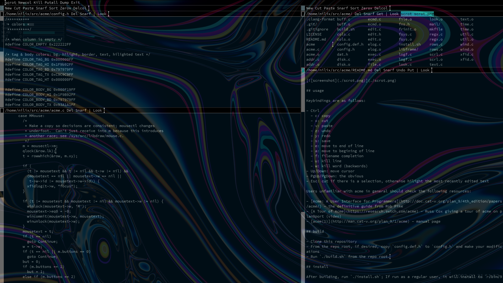

# acme9k

This is a fork of the `acme` text editor from the `plan9port` distribution. It combines the customizability of [lumar](https://github.com/lumar)/[sminez](https://github.com/sminez/plan9port)'s forks and [acme2k](https://github.com/karahobny/acme2k) with upstream fixes from [9fans](https://github.com/9fans/plan9port) and some custom work.

Namely, when click-to-focus is enabled, the active text frame renders the tick (aka the text cursor) with the hilight color (`COLOR_<TAG|BODY>_HI`); otherwise the tick is rendered with the text color (`COLOR_<TAG|BODY>_TX`). This is all done with a fork of `libframe` which is included in the distribution and compiled into the program, and some simple logic that selects the proper ticks for each frame when the focus changes and forces a redraw.

See the `config.def.h` for out of the box customizations that can be done. Below is a screenshot of my typical setup (note I use compositing rules to make the window transparent, this is not in the scope of `acme` itself).

## usage

Keybindings are as follows:

- Ctrl
  - c: copy
  - x: cut
  - v: paste
  - z: undo
  - y: redo
  - s: save
  - e: move to end of line
  - a: move to begining of line
  - f: filename completion
  - u: kill line
  - w: kill word (backwords)
- Up/Down: move cursor
- PgUp/PgDown: the obvious
- Esc: cut if there is a selection, otherwise hilight the most recently edited text

Users unfamiliar with `acme` in general should check the following resources:

- [Acme: A User Interface for Programmers](http://doc.cat-v.org/plan_9/4th_edition/papers/acme/) - the definitive guide from Rob Pike
- [A Tour of Acme](https://research.swtch.com/acme) - Russ Cox giving a tour of acme on plan9port (video)
- [acme(1)](http://man.cat-v.org/plan_9/1/acme) - manual page

## build

- Clone this repository
- From the repo root, if desired, copy `config.def.h` to `config.h` and make your modifications (you will almost certainly want to change the fonts; my default primary font is Sauce Code Pro Nerd Font)
- Run `./build.sh` from the repo root.

## install

After building, run `./install.sh`; If run as a regular user, it will install to `~/bin/9`; if run as root, it will overwrite the systemwide `acme` in `$PLAN9/bin`

## TODO

- [ ] compile helpers

## thanks

- [rob pike](https://github.com/robpike) - author of the original `acme` for Plan9
- [russ cox](https://research.swtch.com) and the rest of the [9fans](https://github.com/9fans) for [plan9port](https://github.com/9fans/plan9port)
- [lumar](https://github.com/lumar) - looks like they deleted their github repos but I originally pulled my keybinds from there
- [sminez](https://github.com/sminez) - possibly the original source of lumar's keybindings
- [karahobny](https://github.com/karahobny) - creator of acme2k, a big inspiration for this project
- [aksr](https://github.com/aksr) - source of the missing tag border pixel fix
